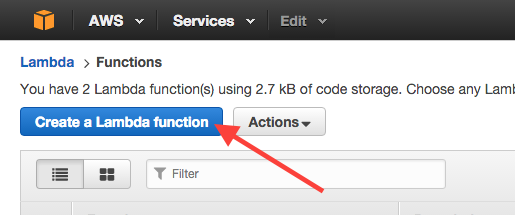
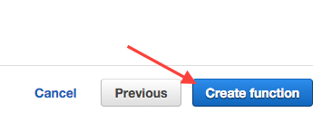

# le-aws-sns
##### AWS Lambda function for sending AWS SNS messages to Logentries in near real-time for processing and analysing
When a message is published to an SNS topic that has a Lambda function subscribed to it, the Lambda function is invoked with the payload of the published message. That message gets forwarded to Logentries by this script, using token TCP.

## Obtain log token(s)
1. Log in to your Logentries account
2. Add a new [token based log](http://docs.logentries.com/docs/input-token)
   * Optional: repeat to add second log for debugging

## Deploy the script on AWS Lambda
1. Create a new Lambda function

   

2. On the "Select Blueprint" screen, press "Skip"

   

3. Configure function:
   * Give your function a name
   * Set runtime to Python 2.7

   

4. Edit code:
   * Edit the contents of ```le_config.py```
   * Replace values of ```log_token``` and ```debug_token``` with tokens obtained earlier.
   * Create a .ZIP file, containing the updated ```le_config.py```, ```le_sns.py``` and ```le_certs.pem```
     * Make sure the files are in the root of the ZIP archive, and **NOT** in a folder
   * Choose "Upload a .ZIP file" in AWS Lambda and upload the archive created in previous step

   

5. Lambda function handler and role
   * Change the "Handler" value to ```le_sns.lambda_handler```
   * Create a new basic execution role (your IAM user must have sufficient permissions to create & assign new roles)

   

6. Allocate resources:
   * Set memory to 128 MB
   * Set timeout to ~1 minute (script only runs for seconds at a time)

  

8. Enable function:
   * Click "Create function"

   

## Configuring Amazon SNS with Lambda Endpoints with the AWS Management Console
1. Sign in to the AWS Management Console and open the Amazon SNS console at https://console.aws.amazon.com/sns/.

2. In the left **Navigation pane**, click **Topics**, and then click the topic to which you want to subscribe a Lambda endpoint.

3. Click **Actions** and then click **Subscribe to topic.**

4. In the **Protocol** drop-down box, select **AWS Lambda.**

5. In the Endpoint drop-down box, select the ARN for the Lambda function.

6. In the Version or Alias drop-down box, select an available version or alias to use. You can also choose $LATEST to specify the latest version of the Lambda function. If you do not want to specify a version or alias, you can also choose default, which is functionally the same as $LATEST.

7. Click Create subscription.

8. Watch your logs come in:
   * Navigate to [your Logentries account](https://logentries.com/app) and watch your CloudWatch logs appear
